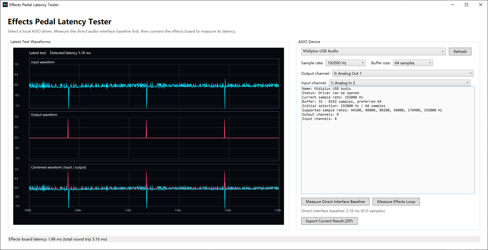

# 이펙터 지연 시간 측정 (.NET 프로토타입)

[English](../README.md) · [简体中文](README.zh-CN.md) · [繁體中文](README.zh-TW.md) · [日本語](README.ja.md) · [한국어](README.ko.md) · [Español](README.es.md) · [Français](README.fr.md) · [Deutsch](README.de.md) · [Italiano](README.it.md) · [Português (Brasil)](README.pt-BR.md) · [Русский](README.ru.md)

Avalonia를 사용하는 .NET 8 데스크톱 앱으로 오디오 인터페이스와 이펙터 보드의 왕복 지연 시간을 측정합니다. Windows는 ASIO, macOS는 Core Audio, Linux는 PortAudio를 통한 ALSA/PipeWire/JACK을 사용합니다.

## 실행

```powershell
dotnet restore
dotnet run --project .\EffectsLatencyTester.csproj
```

## 스크린샷



프로그램은 열 수 있는 첫 번째 오디오 장치를 우선 선택하고 샘플레이트, 버퍼 크기, 입출력 채널을 읽습니다. 테스트 펄스를 출력하고 반환 펄스를 감지한 뒤 입력·출력·결합 파형과 시간축을 표시합니다.

## 연결

1. 오디오 인터페이스 오디오 출력을 이펙터 보드 입력에 연결합니다.
2. 이펙터 보드 출력을 인터페이스 오디오 입력으로 연결합니다.
3. Direct Monitoring을 끕니다.
4. 낮은 볼륨부터 테스트합니다.

## 측정

첫 측정값은 인터페이스 출력, 이펙터 보드, 인터페이스 입력을 포함한 총 왕복 지연 시간입니다. 이펙터 보드 지연만 확인하려면 먼저 출력을 입력에 직접 연결하여 기준을 측정한 다음 이펙터 루프를 측정합니다.

```text
이펙터 보드 지연 = 이펙터 루프 총 지연 - 인터페이스 직접 연결 기준
```

파형 영역은 일반 휠로 가로 이동하고, 드래그로 이동하며, `Ctrl` + 휠로 확대/축소할 수 있습니다. 곡선을 두 번 클릭하면 T1/T2와 시간 차이가 표시됩니다.

## 다국어 지원

시작할 때 시스템 UI 언어를 읽습니다. 한국어, 영어, 중국어(간체·번체), 일본어, 스페인어, 프랑스어, 독일어, 이탈리아어, 브라질 포르투갈어, 러시아어를 제공하며 지원되지 않는 언어는 영어로 대체됩니다.

## 배포

```powershell
.\publish.ps1
```

인수 없이 실행하면 `win-x86`, `win-x64`, `win-arm64`, `osx-x64`, `osx-arm64`, `linux-x64`, `linux-arm64`용 자체 포함 단일 파일을 생성합니다. 한 플랫폼만 만들려면 `-Runtime win-x64`, `-Runtime osx-arm64` 또는 `-Runtime linux-x64` 등을 지정하세요. 대상 컴퓨터에는 .NET을 설치할 필요가 없습니다. Windows에는 해당 ASIO 드라이버가 필요하며 macOS와 Linux는 PortAudio를 통해 각 운영체제의 네이티브 오디오 API를 사용합니다. macOS와 Linux 경로는 실제 하드웨어에서 추가 검증이 필요합니다.

게시 파일 이름은 `EffectsLatencyTester_<os-arch>` 형식입니다. Windows에는 `.exe` 확장자가 붙고 macOS/Linux에는 확장자가 없습니다.
